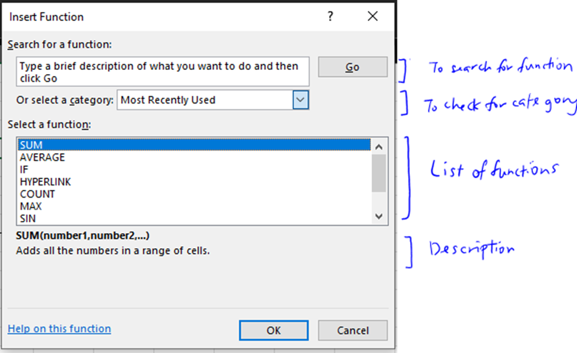

# MS Excel Ultimate Guide

Hello and welcome to MS Excel Ultimate Guide!
Most of these (if not all) apply for Google Sheets, so it's about the same.
The purpose of creating this guide is to increase fellow readers' productivity in MS Excel and I can (hopefully) encounter less badly designed MS Excel documents.

This ultimate guide will include the following sections:	
-   Basic stuffs
-	Cell Reference
-   Cell Automations 
-	Functions and common functions
-	Conditional Formatting
-	
-	
-	…more to be added!
	
If you have idea that you do not know how to do it, and if the idea is possible, do inform me to add it!	
I hope you will enjoy the guide to further improve your productivity.	

---
## Cell Operations

Instead of inserting data manually, it is possible to automate your daily operations.
To perform basic math operation (add+, subtract-, multiply*, divide/, exponent^), so called "Cell Reference" is used. 

For example, to calculate the sum of A1 + B1 in C1, We type =A1+B1.
Example as follows:

This operations are not limited to number operations, dates are also applicable. 

---
## Cell Automations & Dollar Sign usage

Now if you drag down from the bottom right, **notice that the cell reference number will increase**. 

This is where the dollar sign comes in. The dollar sign is added **before the col/row number**, to **fix** the number to remain constant.

---
## Functions

Functions are the main part of productivity optimization in MS Excel, along with cell operations.

To check on the list of functions, simply click the 'fx' button to the left of the text box.

 

Following are the commonly used functions available.

| Functions | Descriptions |
| --- | --- | 
| `SUM(number1, …)`| Returns the sum of the list |
| `IF(condition, true, false)` | IF statement, nested IF statement available, by using `IF(condition, true, IF(condition, true, false))` |
| `AND(condition)` or `OR(condition)` | Boolean logic gates to combine with the IF statement. |
| `VLOOKUP(lookup value, lookup table, col number, exact match` | Lookup from the table and return value |
| `CONCAT("text", or cell)` | Concatenate the string |
| `TEXTSPLIT(text, delimiter)`| Splits the string based on its specified delimiters. |

Anything is possible with the functions, those functions guide are available online.

---
## Conditional Formatting
**Prerequisite: Cell Reference**

Conditional Formatting. As the name implies, the cells are formatted based on its condition (hence conditional formatting).

Conditional Formatting is accessible via Home > Styles > Conditional Formatting > Manage Rules. To create new rules, select new rules. 

Since other sections are mainly explains itself clearly, this will only cover the "Use a formula to determine which cells to format" section. 

### Example usage: Formatting based on the current date.

This usage is taken from the Term 2220 Schedules, where the current week is automated as following:

Breakdown of the conditional formatting rule and its application:
`=AND(TODAY()>=$C4, TODAY()<=$D4)` and `=$B$4:$L$23`

`TODAY()`: Today's date.

`$C4`: C4 is the start of the week, `$C` refers to the C column does not move onto the next cell. and 4 moves to the next cell as the next reference.

`$D4`: D4 is the end of the week, and column is fixed whenever the next cell to conditional format

`AND()`: AND logic gate.

---

## Custom Cell formatting

Cell formatting refers to how the cell will be formatted when inserted numbers, for example, date formats.

To adjust cell formatting: 

If the formatting you wish is not included, you can create a custom format based on your preference.

The full guide is available in [this website](https://www.ablebits.com/office-addins-blog/custom-excel-number-format/):
