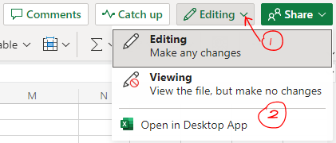
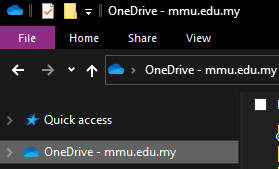
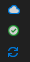
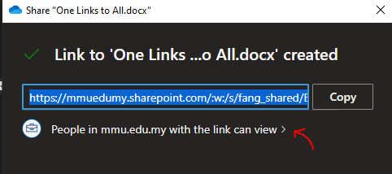
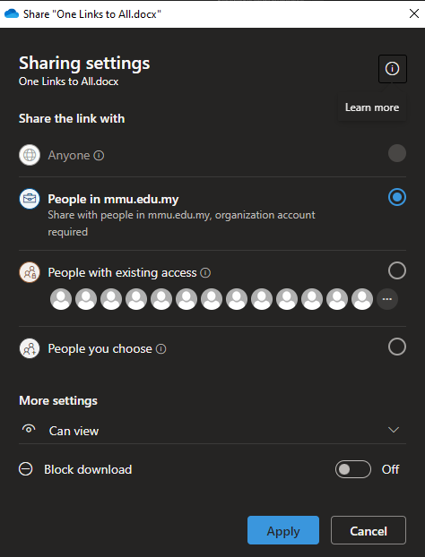
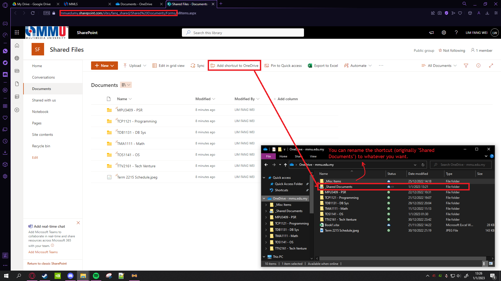

# OneDrive Ultimate Guide

Heyo! This guide's purpose is to help making readers to be aware of the OneDrive uses and improves their productivity in terms of documents management, as well as several advantages. 

**This is especially useful if you want to sync your files across mobile devices and multiple desktops or laptops.**

This [link](https://support.microsoft.com/en-gb/office/what-is-onedrive-work-or-school-10f5c3fd-b0f6-40e2-9059-04735ffe01b7) also provides the guide of using OneDrive.

This ultimate guide will cover in the following sections:
-   Using OneDrive with MMU provided account
-   Uploading files into OneDrive
-   Using OneDrive thru Windows Explorer
-   Clearing files from your local disk
-   Generating document/folder links for collaboration
-   Usage of my [SharePoint](https://mmuedumy.sharepoint.com/sites/fang_shared) and link it as shortcut in your OneDrive

---
## Login to OneDrive

MMU provides full Microsoft 365 access, including OneDrive, which is pretty much useful for your productivity.

To access to Microsoft 365: Click this link here: https://www.office.com, in there you can have access to OneDrive, and also download other office apps there.

All you need to do is login using credentials using your SID@soffice.mmu.edu.my, replacing SID with your Student ID. The password to login **is same as your CamSys / Online Portal / MMLS / etc.**

---
## Uploading files into OneDrive (Online)

To access to the OneDrive (online), click this link: https://mmuedumy-my.sharepoint.com. To upload files, it is as simple as drag and drop. 

To open any documents in your desktop app, on the right corner, select Editing, and Open in Desktop App.

One of the benefits of uploading files into OneDrive and editing from there is **there is autosave feature, which could be life saving.**

---
## Using OneDrive thru Windows Explorer

The main convenience of OneDrive is access of OneDrive via Windows Explorer. How to setup:
1. Start OneDrive if not already on.
2. In your windows taskbar, left/right click the cloud icon and select the gear icon.
3. Select 'Add an account' and then follow the instructions there.
4. Voila! OneDrive is now accessible via Windows Explorer. 

---
## Clearing storage space (Status icons)

There are several types of status icons, that includes:
- Cloud icon - Indicates that (at least one of (if it's folder)) the file is on cloud and not in your system.
- Green tick icon - Indicates that (all (if it's folder)) the files are in your system.
- Refreshing icon - The document is currenting running and autosaving.

To clear storage space, simply right click at the file > **Free Up Space**.

--- 
## Document links for Collaboration

Similar to Google Word Doc/ Sheet, etc, documents can be selected to be shared to others online, without submitting the soft copy. 

To copy the link, simply right click the folder or documents, and press **Share**, or **Copy link**, or **Manage Access**, whichever interface works.

For example, in **Copy Link**, the interface are as follows:

The default permissions is only viewing the document only, press the button indicated by the arrow to change the file link access, then change the "Can view" into the preferred settings.

Click apply and then the link is ready to be copied.

When the link is pressed, it will by default link to the online editor. **Remember that the alignments online might not be correct.**

Hence it is important to open the documents in your desktop apps, for best results.

---

## Usage of my [SharePoint](https://mmuedumy.sharepoint.com/sites/fang_shared) and link it as shortcut in your OneDrive

To link my SharePoint (or any of the SharePoint), simply go to Documents > **Add Shortcut to OneDrive** 

Reminder: The SharePoint is **view only**, hence you may only read and not edit them (or it will cause sync error), make a copy by simply copy into your OneDrive.